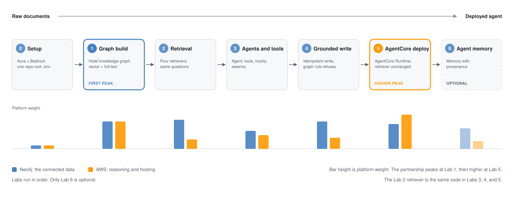

# Grounded AI Agents with Neo4j and AWS: From Raw Documents to a Deployed Agent

[](https://python.org)
[](https://strandsagents.com)
[](https://aws.amazon.com/bedrock/)
[](https://neo4j.com)
[](LICENSE)
[]()

When a booking agent invents a cancellation policy, confirms a room it never checked, or books past the maximum-guest limit, the cost lands on a real guest and a real reservation. An answer a business cannot trace is an answer it cannot act on.

This workshop makes one claim and demonstrates it end to end:

> An agent can only be trusted with a real action if every answer traces back to connected data.

Six labs build that path: from raw documents to a graph, from a graph to grounded retrieval, from retrieval to an agent that uses it, from that agent to a guarded write, and from a working agent to a deployed one on AWS.

Hallucination is the motivation throughout, and it appears as the thing each lab prevents rather than as a taxonomy the labs are sorted into. Lab 2 returns connected facts instead of loose text, then closes on a question the graph cannot answer at all. Lab 4 puts a business rule in the graph and watches it reject a request the prompt alone would have allowed.

**Why Neo4j and AWS?** Two platforms solve different problems well. AWS supplies the reasoning and generation layer. Neo4j makes relationships traversable so retrieval returns connected, verifiable facts. Together they form one grounded agent stack:

- **Neo4j** owns the connected hotel knowledge graph, the retrieval indexes, the production rules, the reservation requests, and the optional inspectable memory.
- **AWS** supplies Bedrock models and embeddings, AgentCore hosting and tool exposure, Secrets Manager, IAM, Lambda integration where needed, and observability through CloudWatch and AgentCore.

The partnership peaks twice, deliberately. Lab 1 is the first peak, where Bedrock extraction and Neo4j storage sit in the same call path through `SimpleKGPipeline`. Labs 2 through 4 are Neo4j-weighted with Bedrock in a supporting role. Lab 5 is the second and higher peak, wrapping the full AWS operational surface around unchanged Neo4j retrieval.

> Based on the Dev.to series [Stop AI Agent Hallucinations: 4 Essential Techniques](https://dev.to/aws/stop-ai-agent-hallucinations-4-essential-techniques-2i94) and [5 Techniques to Stop AI Agent Hallucinations in Production](https://dev.to/aws/5-techniques-to-stop-ai-agent-hallucinations-in-production-oik).

Built with [Strands Agents](https://strandsagents.com) and Amazon Bedrock. The same patterns apply in LangGraph, AutoGen, CrewAI, or any other agent framework.

---

## The six labs



| # | Lab | Notebooks | What you build |
|:-:|-----|-----------|----------------|
| 0 | [Setup](./00-setup/) | None. A credential checklist | An Aura instance, Bedrock access, and one repo-root `.env` |
| 1 | [Graph build](./01-graph-build/) | `1.1_build_graph.ipynb` | The hotel knowledge graph, built live by Bedrock extraction against a pinned schema, with vector and full-text indexes |
| 2 | [Retrieval](./02-retrieval/) | `2.1_vector_retrievers.ipynb`, `2.2_fulltext_retrievers.ipynb`, `2.3_text2cypher.ipynb` | Four retrievers run side by side on the same questions, closing on one the graph cannot answer |
| 3 | [Agents and tools](./03-agents-and-tools/) | `3.1_strands_primer.ipynb` | Agents, tools, lifecycle hooks, and swarms, ending with one named `hotel_agent` that calls the Lab 2 retriever |
| 4 | [The grounded write](./04-grounded-write/) | `4.1_reservation_write.ipynb` | An idempotent reservation write, with a rule read from the graph rejecting a request the prompt alone would allow |
| 5 | [Deploy to AgentCore](./05-agentcore-deploy/) | `5.1_agentcore_deploy.ipynb`, `5.2_teardown.ipynb`, `5.3_agentcore_walkthrough.ipynb` | The same agent hosted on AgentCore Runtime with the retriever unchanged, then torn down |
| 6 | [Neo4j agent memory](./06-memory/) | `6.1_neo4j_agent_memory.ipynb` | Optional. Graph-native memory with provenance and actor isolation |

Only Lab 6 is optional. `2.3_text2cypher.ipynb` and `5.3_agentcore_walkthrough.ipynb` are optional notebooks inside required labs.

> **Build status:** every notebook is in place. Labs 1 through 4 and Lab 6, seven notebooks, pass `uv run setup/run_notebooks.py` against a live Aura instance and Amazon Bedrock. Lab 5's three notebooks pass both gates: the offline one, where each live cell self-skips without credentials, and a full run against real AWS resources, which deployed the agent to AgentCore Runtime, passed four smoke questions, and then tore everything down to nothing. `new-content-plan.md` Phase 8 holds the evidence.

## Why this order

**Neo4j first, because the evidence has to exist before anything can be grounded in it.** A participant who has watched `VectorRetriever` and `VectorCypherRetriever` answer the same question differently understands why connected data matters, in a way no slide achieves. Putting agents first would invert this: the agent becomes the interesting part and the graph becomes plumbing, which is the opposite of the lesson.

**Agents second, because a tool is more concrete than a framework.** Lab 3 opens the Strands primer with a retriever already in hand. Agents, tools, and hooks arrive as answers to a question the participant already has.

**The agent block is two labs.** Lab 3 is the framework, where the participant gets a working agent that calls the Lab 2 retriever as a tool. Lab 4 is acting safely, where a rule in the graph stops an action the prompt alone would allow. Splitting them keeps the primer from competing with the write path for attention.

**AgentCore last, because deployment is only meaningful once there is something worth deploying.** Lab 5 takes the exact agent from Lab 4 and hosts it on AWS without changing the retriever. The Neo4j retrieval logic is identical, and only the operational surface around it changes.

Memory closes as optional material rather than as the finale, so the core path ends on the AWS crescendo.

---

## The two hero questions

The workshop is anchored by two questions asked against the same graph:

- *"What amenities and guest rating does AnyCompany Cairo Nile View have?"* returns connected, grounded evidence.
- *"Does AnyCompany Cairo Nile View guarantee room availability next weekend?"* makes the agent abstain, because the graph holds no live availability. The abstention is the point: the agent answers only from evidence.

Both appear first in Lab 2, again inside an agent in Lab 3, and again against the deployed Runtime in Lab 5.

## Graph-RAG vs standard RAG

| Approach | Hallucination risk | Retrieval method | Best for |
|---|---|---|---|
| Standard RAG (vector) | High. Returns similar content even when irrelevant | Cosine similarity | General Q&A |
| Graph-RAG (Neo4j) | 73% lower per RAG-KG-IL, arXiv 2503.13514; grounded in entity relationships | Graph traversal plus Cypher | Structured domains such as hotels, products, and finance |

> **Key insight:** Vector search always returns *something similar*, even when the answer does not exist in the database, which causes fabrication. Graph-RAG returns only what is explicitly connected in the knowledge graph.

**What comes back for "amenities at AnyCompany Cairo Nile View?"**

| Approach | What the agent gets back |
|---|---|
| Vector search alone | "Here are text chunks mentioning pool, gym, and free breakfast." |
| Graph-RAG (Neo4j) | "Here are amenity chunks for AnyCompany Cairo Nile View, with its stable `hotel_id`, guest rating 4.5, connected to its amenities and cancellation policy, or nothing if the graph has no such hotel." |

Lab 2 runs both against the same graph so the difference is watched rather than described. The mechanism in one sentence: vector search finds candidates, traversal finds what is connected.

---

## Platform Responsibilities

| Responsibility | Neo4j | AWS |
|---|---|---|
| Connected domain data | Hotel knowledge graph and relationship traversal | Bedrock extracts entities and relationships in Lab 1, then reasons over retrieved evidence |
| Retrieval | Vector, full-text, and graph traversal indexes | Bedrock creates document and query embeddings |
| Production graph reads | Vector and full-text indexes plus a reviewed graph traversal | AgentCore Runtime hosts the `HybridCypherRetriever` and Bedrock supplies query embeddings |
| Reservation request | Stores the workshop-owned request, relationship, and production rule | One Lambda validates and performs the command |
| Rules | The Lab 4 `Rule` node, read inside the write transaction | Strands lifecycle hooks in Lab 3 show the in-process alternative Lab 4 replaces |
| Memory | Optional inspectable memory graph with provenance | AgentCore Memory is the managed alternative the Lab 6 callout weighs it against |
| Security and operations | Read and write roles appropriate to each service | IAM, Secrets Manager, Runtime, Gateway, CloudWatch, and AgentCore observability |

## Data Ownership

| Data | Owner |
|---|---|
| Hotels, amenities, policies, rooms, services, and graph relationships | Neo4j |
| Chunk vector and full-text indexes | Neo4j |
| The `max_guests` production rule | Neo4j |
| Workshop reservation requests | Neo4j |
| Optional agent memory and its provenance | Neo4j |
| Credentials | AWS Secrets Manager |
| Traces and logs | AgentCore and CloudWatch |
| Real inventory, booking, payment, and confirmation state | External reservation system |

**One Neo4j Aura instance is enough.** A single Aura graph supports retrieval, the production rule, the reservation requests, and the optional inspectable graph memory. There is no separate hotel catalog to maintain and no duplicated store to keep in sync.

**DynamoDB is not part of the path.** The expanded production architecture may identify DynamoDB as one optional persistence choice behind an external reservation system. The workshop does not create or teach DynamoDB hotel, rule, booking, or payment tables, and real inventory, booking, payment, and confirmation state stay behind that external-system boundary.

---

## The shared `workshop/` package

Nine modules are used by more than one lab, so they live in one installable package at [`workshop/`](workshop/) rather than being copied between lab folders:

| Module | Labs that need it |
|---|---|
| `retrieval_contract.py` | 1, 2, 4, 5 |
| `bedrock_providers.py` | 1, 2 |
| `retrieval_setup.py` | 1, 2 |
| `graph_connection.py` | 1, 2, 4, 5 |
| `graph_schema.py` | 1, 2 |
| `contracts.py` | 2, 4, 5 |
| `graph_setup.py` | 1, 4 |
| `hybrid_retrieval.py` | 2, 3, 4, 5 |
| `reservation_command.py` | 4, 5 |

The five embedding and index constants matter most. `EMBEDDING_MODEL_ID`, `EMBEDDING_PURPOSE`, `EMBEDDING_DIMENSIONS`, `CHUNK_VECTOR_INDEX`, and `CHUNK_FULLTEXT_INDEX` have to agree between the lab that writes the graph and the labs that read it. A mismatch returns wrong results with no error, so they have exactly one definition.

Each lab keeps its own `requirements.txt`, and each one installs the shared package in editable mode with `-e ../workshop`.

---

## How do I run the labs?

### Prerequisites

- Python 3.12+
- [uv](https://docs.astral.sh/uv/) package manager
- An AWS account with [Amazon Bedrock](https://aws.amazon.com/bedrock/) access, with `us.anthropic.claude-sonnet-5` and `amazon.nova-2-multimodal-embeddings-v1:0` enabled in your region. Optional Lab 6 needs a third, `amazon.titan-embed-text-v2:0`, which is what the memory graph embeds with; Labs 1 through 5 never touch it
- One Neo4j Aura instance

Start with [`00-setup/README.md`](00-setup/README.md), which is the credential checklist. It is a README rather than a notebook because nothing needs executing yet.

### Run a lab

```bash
cd 01-graph-build   # or any lab folder
uv venv && uv pip install -r requirements.txt
```

Then open the lab's `N.M_*.ipynb` notebooks in order, in VS Code, Kiro, or any editor with notebook support. Each lab README lists its notebooks and its prerequisites.

Labs run in order the first time. Lab 2 needs the graph Lab 1 built, Lab 3 needs the retriever Lab 2 introduced, Lab 4 needs the `hotel_agent` Lab 3 assembled, and Lab 5 deploys what Lab 4 produced.

### Run the notebooks as tests

The shared runner uses `nbconvert` to execute source notebooks without modifying them. It creates its own cached environment through `uv`, writes executed notebooks to a temporary directory, and exits nonzero if a cell raises:

```bash
uv run setup/run_notebooks.py              # Labs 1 through 4 and 6
uv run setup/run_notebooks.py --labs 2     # One lab
uv run setup/run_notebooks.py --labs 2-4   # A range
uv run setup/run_notebooks.py --list       # Show the notebook registry
```

Every live cell self-skips when Neo4j or Bedrock credentials are absent, so the default run is green offline and creates no AWS resources. Lab 5 touches real, billable AWS resources and is gated behind explicit flags:

```bash
uv run setup/run_notebooks.py --labs 5 --include-deploy
uv run setup/run_notebooks.py --labs 5 --include-cleanup
```

A clean run only proves cells did not raise. It does not validate narrative claims unless the notebook itself asserts them. See [`setup/README.md`](setup/README.md) for the complete command reference.

### Run the Python tests

Tests are per-lab and run from inside the lab directory:

```bash
cd 04-grounded-write
uv run --with pytest --with-requirements requirements.txt -m pytest
```

The suites, as they stand: 12 tests in Lab 1, 56 in Lab 4, 20 in Lab 5, and 22 in Lab 6. Of Lab 4's 56, the reservation command and its contracts account for 29, spread across `test_reservation_command.py` and `test_contracts.py`. Live tests self-skip when credentials are absent.

### Provision the AgentCore infrastructure (Lab 5 only)

Labs 1 through 4 never need this and create no AWS resources beyond Bedrock inference calls. Lab 5 stands up the slow, privileged infrastructure first: the Neo4j command secret, three least-privilege IAM roles, the reservation Lambda, and the AgentCore Gateway with its single target. It then writes a handful of identifiers into the repo-root `.env` for the deploy step to read.

```bash
uv run setup/provision_agentcore.py provision   # Create the AgentCore infrastructure
uv run setup/provision_agentcore.py status      # Report what exists
uv run setup/provision_agentcore.py teardown    # Delete it again
```

This creates real, billable AWS resources. `5.2_teardown.ipynb` removes what Lab 5 created, scoped by tag, and refuses to touch untagged resources.

### Notebook setup (nbstripout)

This repository strips notebook output on commit through a git filter declared in `.gitattributes`. Register the filter once after cloning, or every `.ipynb` checkout runs against an undefined filter:

```bash
uv tool install nbstripout
nbstripout --install
```

Run both commands from the repository root. Only contributors need this. Running the labs does not.

---

## Neo4j setup

One Aura instance serves every lab.

**Create the credentials once at the repo root.** Copy `.env.example` to a single `.env` file in the repository root and fill in your Aura values:

```bash
cp .env.example .env
```

```
NEO4J_URI=neo4j+s://<your-instance>.databases.neo4j.io
NEO4J_USERNAME=neo4j
NEO4J_PASSWORD=<your-password>
NEO4J_DATABASE=neo4j
AWS_REGION=us-east-1
```

Every lab loads the nearest `.env` first, so a `.env` inside a lab folder takes precedence over the repo-root file. Keeping one file at the root is the simplest setup.

**Running as part of a workshop:** an Aura instance will be provided, and you will receive `NEO4J_URI`, `NEO4J_USERNAME`, and `NEO4J_PASSWORD` at the start of the session. Add them to the repo-root `.env`.

> **Workshop Studio username variable:** the hosted CloudFormation environment writes `NEO4J_USER`, while every lab in this repository reads `NEO4J_USERNAME`. If a lab cannot authenticate inside the hosted workshop, confirm which name is set.

**Running independently:** create your own free Neo4j Aura instance.

1. Go to [console.neo4j.io](https://console.neo4j.io) and create a free **AuraDB** instance
2. Download the credentials file when prompted; it contains your URI, username, and password
3. Fill in the repo-root `.env` created above with those values
4. Run Lab 1 to populate the graph

APOC Core is preinstalled on every Aura instance, so there is no plugin to enable. Lab 1's graph build uses it and finds it already there. A self-hosted Neo4j is the only case that needs the plugin installed by hand.

**Nothing ships pre-embedded.** Only the raw hotel-FAQ corpus, `01-graph-build/hotel-faqs.zip`, is checked into git. The graph is a build artifact that every participant generates in Lab 1: 30 documents in about 15 minutes for the lite build, or 300 documents in about 2 hours for the full build.

---

## Frequently asked questions

### What kinds of agent failure does this workshop address?

Three, and each one is prevented in a specific lab rather than described. **Fabricated evidence**, where a retriever returns text that merely looks relevant, is what Lab 2's traversal-backed retrievers replace with connected facts. **Answering past the edge of what is known**, where an agent guesses rather than declining, is what Lab 2 closes on and Lab 3 carries into an agent. **Business rule violations**, where an agent ignores a constraint expressed only in a prompt, is what Lab 4's graph-resident rule rejects inside the write transaction.

Earlier versions of this repository organized around four hallucination categories, one demo each. Two of those categories, wrong tool selection and undetected failures in single-agent runs, no longer have a live demonstration here. The labs build on each other now, which the category tour could not express.

### What do Neo4j and AWS each provide?

Neo4j holds the connected hotel knowledge, the retrieval indexes, the production rule, the reservation requests, and the optional inspectable memory. AWS supplies Bedrock models and embeddings, AgentCore hosting and tool exposure, Secrets Manager, IAM, Lambda integration where needed, and observability. See the Platform Responsibilities and Data Ownership tables above.

### Do I have to run the labs in order?

The first time, yes. Each lab consumes what the previous one produced. Once the graph exists, Labs 2 through 4 can be revisited in any order against it.

### Do I need DynamoDB?

No. It appears only as one optional persistence choice behind an external reservation system in the going-further notes. The workshop does not create or teach DynamoDB tables.

### Can I use these patterns with frameworks other than Strands Agents?

Yes. Graph-RAG retrieval, tool boundaries, lifecycle hooks, and rules read from a graph inside a write transaction are framework-agnostic. These labs use Strands Agents, but the same approaches apply in LangGraph, AutoGen, CrewAI, Haystack, or a custom implementation. The insight is architectural, not framework-specific.

### Do I need an AWS account?

Yes. Every lab uses Amazon Bedrock, for extraction and embeddings in Lab 1 and for reasoning after that.

### How long does each lab take?

Lab 1 is dominated by the graph build: about 15 minutes for the lite corpus. Labs 2 through 4 are notebook-paced. Lab 5 creates and deletes real AWS infrastructure and is the longest of the rest.

Machine execution time is measured, and it is a floor rather than a budget. All seven notebooks outside Lab 5 execute in 311 seconds against a graph that is already built: `1.1` 7.7s on the already-complete path, `2.1` 18.3s, `2.2` 39.9s, `2.3` 17.0s, `3.1` 89.4s, `4.1` 33.5s, `6.1` 105.4s. That says nothing about reading, discussion, or a participant sorting out their own credentials. A rehearsed participant-facing budget is still outstanding.

### What LLM providers are supported?

Every lab defaults to Amazon Bedrock with Claude Sonnet 5, and works with any provider supported by Strands Agents: the Anthropic API, OpenAI, Ollama for local models, or any OpenAI-compatible endpoint. Lab 1's extraction and the embeddings are Bedrock-specific. See [Strands Model Providers](https://strandsagents.com/docs/user-guide/concepts/model-providers/amazon-bedrock/).

---

## Common issues and how to fix them

**Bedrock access denied:** enable the model in your region via the [Bedrock Model Access console](https://console.aws.amazon.com/bedrock/home#/modelaccess), and confirm `AWS_REGION` in the repo-root `.env` names that same region. Three models are involved and access to one proves nothing about the others: `us.anthropic.claude-sonnet-5` for reasoning and Lab 1's extraction, `amazon.nova-2-multimodal-embeddings-v1:0` for the chunk vectors Lab 1 writes and Lab 2 onward query, and `amazon.titan-embed-text-v2:0` for optional Lab 6's memory embeddings.

**Neo4j connection fails:** verify `NEO4J_URI`, `NEO4J_USERNAME`, and `NEO4J_PASSWORD` are set in your `.env` file. `NEO4J_DATABASE` is optional and defaults to `neo4j`, which is what Aura provisions.

**Lab 2 returns nothing:** the graph is missing or was built with different embedding settings. Re-run Lab 1. Each Lab 2 notebook opens with a verification cell that names what is absent.

**Lab 4 reports no rule:** Lab 1's closing cell seeds the `Rule` node. Re-run it.

**Document counts do not match after a build:** two builds overlapped, or a previous build was interrupted. Re-run Lab 1 on its own and let it finish; it clears the previous graph before it starts.

**OpenTelemetry warnings:** "Failed to detach context" warnings are harmless.

**Model alternatives:** change the model by modifying the `BedrockModel(model_id=...)` call. See [Strands Model Providers](https://strandsagents.com/docs/user-guide/concepts/model-providers/amazon-bedrock/).

For lab-specific issues, check the troubleshooting section in each lab's README.

---

## From workshop to production

The workshop is deliberately small. A real deployment grows from here in four ways:

- **Add more data and rules to the graph.** The workshop uses a small set of hotels. Production adds more hotels, more relationships between them, and the business rules that keep answers correct.
- **Keep returning the right evidence.** Tune how the agent searches the graph so it still finds the connected facts an answer needs as the amount of data grows.
- **Run and watch the agent.** Lab 5 hosts the agent on AgentCore and correlates one request end to end, so you can see exactly what the agent did and why.
- **Keep the graph up to date.** Build the process that loads new documents into the graph over time.

Neo4j Aura is Neo4j's fully managed cloud graph database service. Neo4j and AWS are collaborating to deepen the integration of Neo4j with Amazon Bedrock and AgentCore.

---

## References

1. Fuentes, E. (2025). *Stop AI Agent Hallucinations: 4 Essential Techniques.* Dev.to / AWS. [dev.to/aws/stop-ai-agent-hallucinations-4-essential-techniques-2i94](https://dev.to/aws/stop-ai-agent-hallucinations-4-essential-techniques-2i94)
2. Fuentes, E. (2025). *5 Techniques to Stop AI Agent Hallucinations in Production.* Dev.to / AWS. [dev.to/aws/5-techniques-to-stop-ai-agent-hallucinations-in-production-oik](https://dev.to/aws/5-techniques-to-stop-ai-agent-hallucinations-in-production-oik)
3. Edge et al. (2024). *From Local to Global: A Graph RAG Approach to Query-Focused Summarization.* Microsoft Research. [arXiv:2404.16130](https://arxiv.org/abs/2404.16130)
4. AWS. *Reducing hallucinations in large language models with custom intervention using Amazon Bedrock Agents.* [AWS Blog](https://aws.amazon.com/blogs/machine-learning/reducing-hallucinations-in-large-language-models/)

---

## Contributing

Contributions are welcome. See [CONTRIBUTING](CONTRIBUTING.md) for more information.

## Security

If you discover a potential security issue in this project, notify AWS/Amazon Security via the [vulnerability reporting page](https://aws.amazon.com/security/vulnerability-reporting/). Please do **not** create a public GitHub issue.

## License

This library is licensed under the MIT-0 License. See the [LICENSE](LICENSE) file for details.

> Last updated: August 2026 | Strands Agents 1.27+ | Python 3.12+
